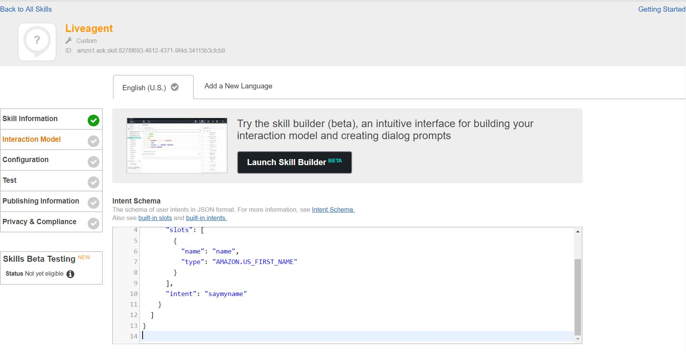
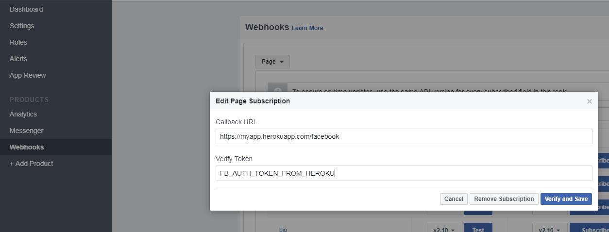

# Alexa and Dialogflow (API.AI / Google Home) bot, integrated with Salesforce and Salesforce Live Agent.

This is one webhook to rule them all. This project uses the following platforms:
1. [Heroku](https://www.heroku.com/)
2. [Dialogflow (formerly API.AI)](https://dialogflow.com/)
3. [Amazon Alexa](https://developer.amazon.com/)
4. [Facebook](https://developer.facebook.com/)
5. [Twilio](https://www.twilio.com/)
6. [Salesforce](https://www.salesforce.com/)


# Set up Dialogflow (API.AI)

1. Log into Dialogflow and create a new agent.

2. Click on the gear icon, the Export and Import tab, and the RESTORE FROM ZIP button. Upload [this zip file](bots/dialogflow/liveagent-bot.zip).

3. Go to Fulfillment tab and update the endpoint URL to the Heroku URL (after you set up heroku, obviously). It will be something like `https://myapp.herokuapp.com/webhook`. `/webhook` is added because that is the route defined in `index.js` for the dialogflow router.


# Set up Amazon Alexa

1. Log in to the [Amazon Developer Console](https://developer.amazon.com/edw/home.html#/) and click on Alexa Skills Kit. Then click on Add a new skill.

2. Give your skill a name and invocation phrase.


3. Fill out the [Schema](bots/alexa/intentSchema.json) and [Utterances](bots/alexa/utterances.txt)



4. Fill in a dummy endpoint. You'll need to come back here and fill in with the heroku endpoint. Again, it will be something like `https://myapp.herokuapp.com/alexa/sms`. This time, `/alexa` is added because that is the route defined in `index.js` for the alexa router. Since both a `/sms` route and `/voice` route are defined in our alexa router, the path looks like `/alexa/sms` to handle inbound text messages from Twilio. 


# Set up Heroku

1. Deploy this webhook to heroku

    [](https://heroku.com/deploy)

2. Fill in the environment variables.

# Set up Twilio

# Set up Facebook


# The Code

Let's check out the code.

```javascript
const dotenv = require('dotenv').config();
const express = require('express');
const bodyParser = require('body-parser');
const request = require('request-promise');
```

So what we have is a node app, created with express, listening to port 5000 (unless PORT is defined). 

```javascript
const twilio = require('./routers/twilio');
const facebook = require('./routers/facebook');
const dialogflow = require('./routers/dialogflow');
const alexa = require('./routers/alexa');
```

Here we are defining our routes for each of the integration points: Twilio, Facebook, Dialogflow (API.AI), and Alexa.

# Alexa Skill

```javascript
alexa.launch( function( request, response ) {
  //What to say when Alexa app is first opened.
  response.say('Welcome to My App.' );
}) ;
```

Customize the launch callback to customize what Alexa says / does when you say "Open My App".

```javascript
alexa.intent('welcomeUser',
  (req,res, slots) => {
    res.say("Welcome "+ slots.name).end();
    var name = slots.name;
    //log Bot Chat to Salesforce
    salesforce.logToSalesforce('Bot',
                               'Alexa',
                               {id: req.data.session.sessionId  , name: name},
                               req.data.session.sessionId,
                               'My name is ' + name,
                               'Hello ' + name
                              );
  });
```

Here is the real magic. This is where we can access slots that we've defined in our Alexa skill, perform some logic, and ultimately return a response through `res.say`. We are also using our Salesforce helper to log some information to Salesforce.


# Tools for Development

We of course need to develop and test the webhook before being deployed to the host. Below are the utilities I used. 

* [Postman](https://chrome.google.com/webstore/detail/postman/fhbjgbiflinjbdggehcddcbncdddomop) - Use it to send some test payloads to the webhook.

* [ngrok](https://ngrok.com/) - Creates a public https tunnel mapped to a port on my machine. It gives me a url that I can use as a webhook for my agent. Use this to actually integrate your agent to the webhook.

* [heroku-cli](https://devcenter.heroku.com/articles/heroku-cli) - Well, only if you'll be deploying to heroku.

